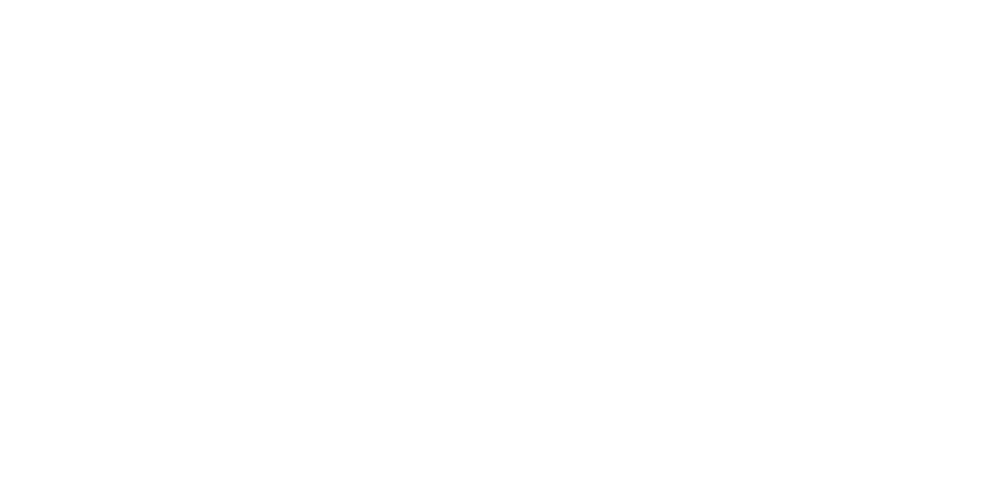

<p align="center">
  <a href="https://ui.justinlevine.me">
    
  </a>
</p>

<p align="center">
  A curated <a href="https://ui.shadcn.com">shadcn</a>-style component registry by <a href="https://justinlevine.me">Justin Levine</a>.
</p>

**Docs & previews:** [ui.justinlevine.me](https://ui.justinlevine.me)

## Install

```bash
npx shadcn@latest add https://ui.justinlevine.me/r/[component].json
```

## Commands

```bash
pnpm install        # install dependencies
pnpm dev            # start dev server
pnpm build          # shadcn build + next build
pnpm registry:build # registry only
```

## Design principles

- **Self-contained** — components work without shadcn primitives unless complex interaction justifies it
- **Zero dependencies preferred** — no Motion, no extra packages unless the payoff is clear
- **Server-first** — async server components where it makes sense
- **Strong defaults** — useful out of the box, not a blank canvas

## License

[MIT](./LICENSE)
